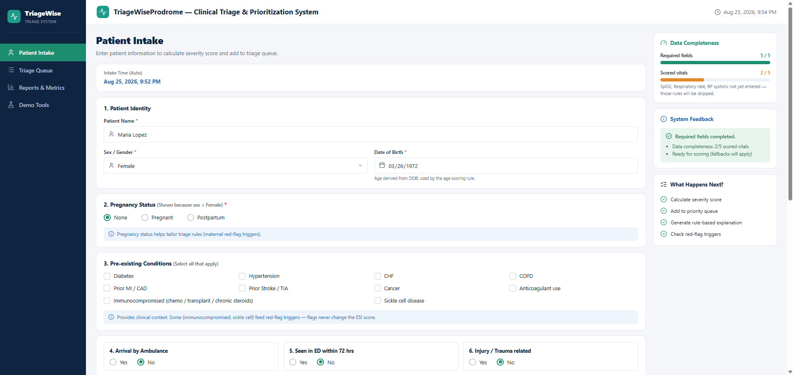
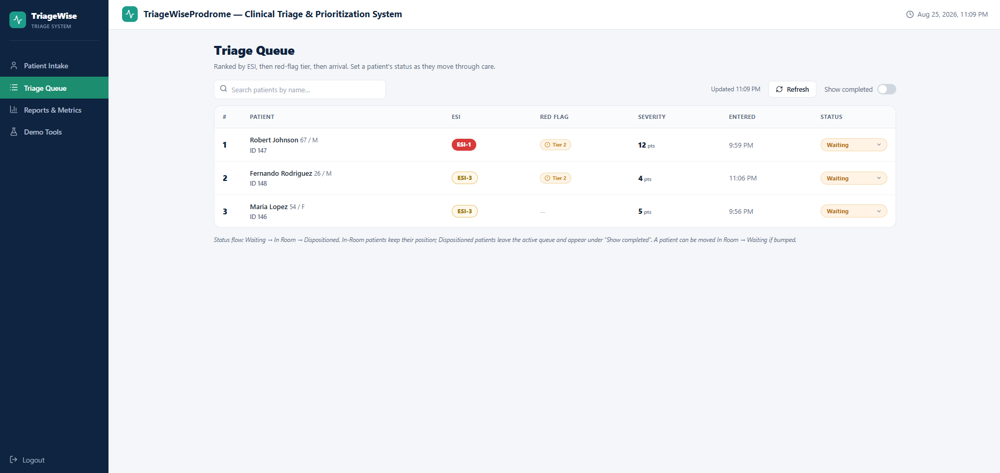
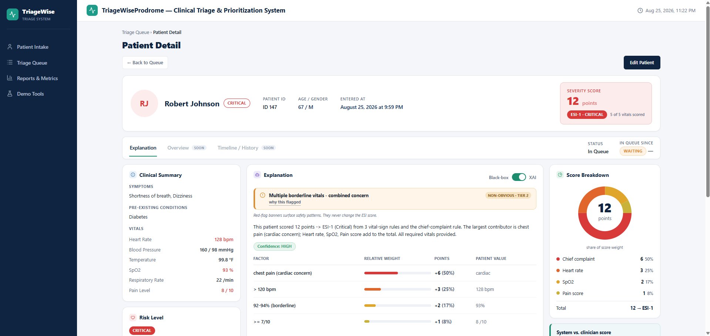
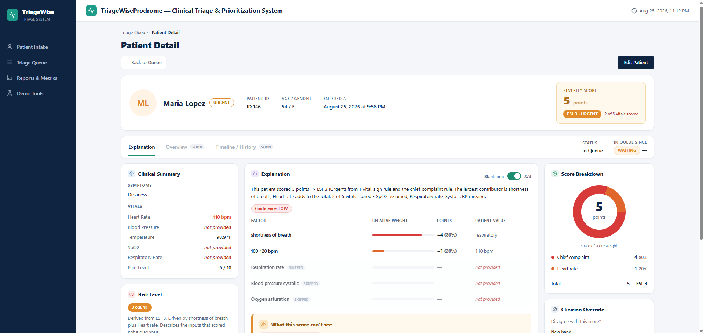
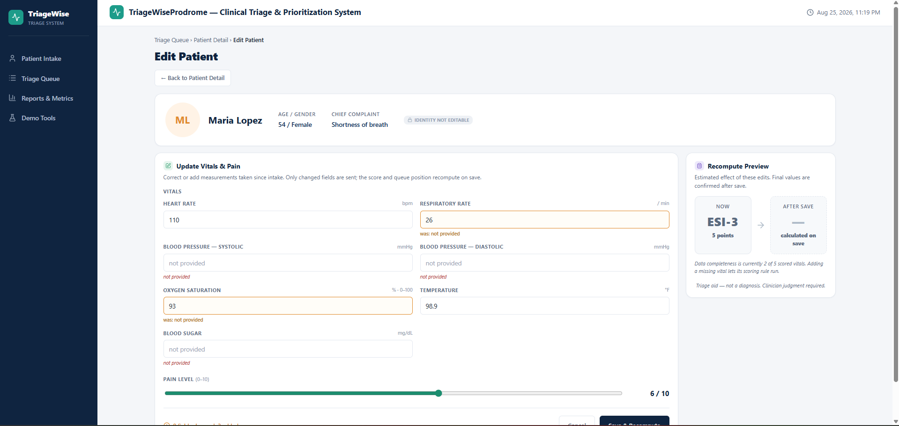
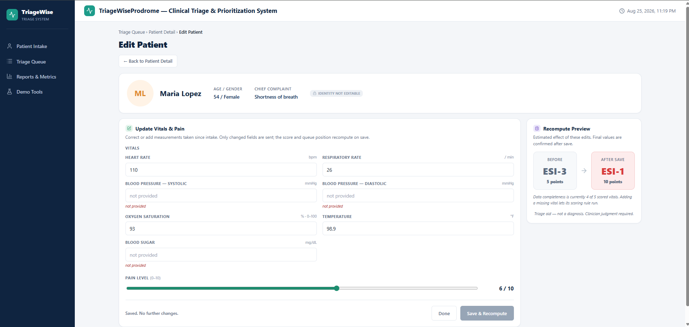

# TriageWiseProdrome · [](https://github.com/NvyGreen/TriageWiseProdrome/actions/workflows/backend-tests.yml)

A rule-based clinical triage and prioritization engine. It takes an emergency-department intake, assigns an ESI-style acuity level from transparent weighted rules, raises non-obvious red flags, and orders patients in a priority queue — while keeping every decision explainable and leaving final judgment with the clinician.

> Simplified and educational. Not clinically validated. It explains and prioritizes; it does not diagnose.

[triage-wise-prodrome.vercel.app](https://triage-wise-prodrome.vercel.app)

## Problem

In an emergency department, minutes matter, and two common failure modes show up in triage tooling: black-box acuity models that weigh many signals at once but can't show *why* they landed on a number, and simple rule- or checklist-based tools that are transparent but score one axis at a time rather than weighing how signals combine. Neither lets a clinician both see the reasoning *and* trust that combinations were accounted for — and the dangerous cases are often the ones that look normal: an elderly patient with vague symptoms and unremarkable vitals, a febrile newborn, early shock hiding behind borderline numbers. A triage aid is only trustworthy if its reasoning is visible and the clinician stays in control.

## Solution

TriageWiseProdrome scores acuity from transparent, weighted rules rather than a model, so every decision traces back to a specific rule and the patient's actual value. Missing data is handled honestly — it lowers confidence instead of guessing. A separate red-flag layer catches atypical "looks-normal-but-isn't" presentations without ever altering the score. Patients are ordered in a priority queue, and each ranking comes with a plain-language explanation. The rule weights, thresholds, and red-flag patterns all live in the database and are grounded in real emergency-department admission rates, so the system can be re-tuned without touching code — and the clinician can override any decision.

Intake submission returns immediately with a `pending` status; scoring runs out-of-band in a separate worker process, and the UI polls until the result is ready.

## Features

- **Transparent ESI scoring** — weighted vital and complaint rules map to an ESI level (1–5), with ESI-3 refined by expected resource use.
- **Honest missing-data handling** — per-rule fallbacks, data-completeness tracking, and a confidence downgrade instead of silent guessing.
- **Red-flag detection** — structured AND/OR trigger trees catch occult presentations, maternal risk, febrile neonates, and early shock. Flags reorder the queue and surface a banner; they never change the score.
- **Priority queue** — a Postgres-backed queue ordered by `(ESI band, flag tier, arrival time, intake id)`, re-ranked as records are updated or overridden.
- **Structured 4-part explanation** — every scored patient carries a named-driver breakdown (factor, threshold, actual value, weighted contribution), a data-completeness summary, an explicit gap acknowledgement (what the engine can't see), and a standing clinician-judgment disclaimer.
- **Plain-language summaries** — a narrative lede and a short risk-level blurb are composed from the stored breakdown at read time, deterministically.
- **Presentation-mode toggle** — the same scored case renders two ways: full explanation (XAI) or score-and-level only (black-box), with the reasoning stripped at the response layer so it never leaves the server.
- **Dual-score disagreement** — when a clinician supplies their own ESI, the system surfaces both side by side and names the drivers that account for the gap.
- **Illustrative base rates** — an optional, clearly-labelled population admission-rate line from a static reference table, never presented as this patient's probability.
- **Clinician override** — the system's ESI can be overridden with a structured reason; the override is logged, re-orders the queue by the clinician's value, and is recorded for later review.

## Architecture & tech stack

A FastAPI web app accepts intakes and serves reads; a separate scorer process does the scoring. Both share PostgreSQL, with a React frontend on top.

```
POST /patients ──> TriageService.submit_intake ──> intake_record (scoring_status='pending')
                                                              │
                        ┌─────────────────────────────────────┘
                        │  app/scorer.py  (separate process)
                        │  claims one row: FOR UPDATE SKIP LOCKED
                        ▼
                   TriageService.score_intake
                        ├──> ScoringEngine ──> RedFlagLayer ──> patient_severity
                        ├──> ExplanationBuilder ──> ai_explanation
                        └──> triage_queue row        (all in one transaction)

GET /queue ──> single indexed read of triage_queue, ordered by
               (esi_band, flag_tier, arrival_time, intake_id)
```

- **ScoringEngine** — produces a `SeverityResult` (score, ESI, drivers, data-quality signals) from an intake. The red-flag layer is injected into `score()`, so the engine attaches flag metadata to the result without owning flag logic — and the flag layer can be swapped or mocked independently. Flags never change the numeric score.
- **RedFlagLayer** — evaluates each rule's condition tree and returns fired triggers. Read-only with respect to the score.
- **Scorer (worker process)** — claims pending intakes with `FOR UPDATE SKIP LOCKED`. Claim, score, and status write share one transaction: a crash rolls back and the row stays `pending` for the next pass, so there are no stuck rows and no recovery job. The same claim mechanism lets several scorers run concurrently without coordination, so throughput can be increased by starting more of them. The deployment runs a single scorer; there is no autoscaling.
- **Queue** — persisted in `triage_queue`, ordered by a composite index on `(esi_band, flag_tier, arrival_time, intake_id)`. Rank is a tuple-comparison count, and reads are `LIMIT`-bounded, so queue cost is O(limit) rather than O(n).
- **TriageService** — coordinates the services and owns persistence and event logging, but not the transaction — the scorer does.

Reference data (scoring weights, ESI bands, red-flag patterns, vital ranges, condition base rates) is loaded from CSV into lookup tables and read at runtime — changing a weight or a threshold needs no code change.

**Stack:** Python · FastAPI · SQLAlchemy · Alembic · Pytest · PostgreSQL · React + Vite · honcho (web + worker) · deployed on Vercel.

## Engineering & quality

- **Config-driven, not hardcoded** — scoring weights, thresholds, complaint tiers, and red-flag patterns live in reference tables read at runtime; re-tuning is a data change, not a code change.
- **Structured red-flag evaluation** — trigger patterns are stored as machine-evaluable JSON condition trees (AND/OR groups, field checks, helper calls) rather than parsed prose, so rules can be added or edited as data.
- **Clean separation of concerns** — scoring, red-flag detection, and queueing are independent services; the red-flag layer is injected into scoring rather than hardwired, so it can be swapped or mocked, and red flags never alter the numeric score.
- **Consistent API error contract** — every error returns a structured envelope with a stable code (`invalid_input`, `not_found`, `duplicate_request`, `unscoreable`, `internal_error`), a message, and a request id.
- **Idempotent writes** — mutating endpoints require an idempotency key so retries don't double-submit.
- **Efficient queue reads** — the whole queue is assembled in a single joined query rather than one lookup per patient.
- **Tested and CI-gated** — a fixture-driven Pytest suite covers scoring, ESI refinement, missing-data fallbacks, red-flag evaluation, the explanation/lede/dual-score/base-rate rendering, override logging, and input validation; `main` is protected and merges only on green tests.

## Data & validation

- **Scoring anchor:** rule weights are grounded in **NHAMCS 2022** emergency-department admission rates. This sets *why* a rule carries the weight it does — it is not a test of the output.
- **Outcome validation:** measuring the system's assigned ESI against real patient outcomes (admitted / ICU / discharged) using **MC-MED** and **Synthea**-generated records. This is the check on whether the prioritization is actually right.
- **Interoperability (in progess):** the schema carries FHIR-ready fields (`source`, `external_patient_id`) so records can originate from a FHIR feed later.

## Security

- **Allowlist-validated dynamic field access** — the red-flag engine resolves field names supplied by stored condition trees via `getattr`. Each name is validated against the intake table's real columns before access, so a malformed or malicious tree can't reach arbitrary attributes.
- **Locked-down CORS** — restrict allowed origins to the known frontend rather than a wildcard.

## Project status

| Area | Status |
| --- | --- |
| Data model + migrations | Complete |
| Reference-data loading (scoring, red-flag, ESI, vitals) | Complete |
| Scoring engine (bands, ESI-3 refinement, fallbacks, drivers) | Complete |
| Red-flag layer (tree evaluation, tiers) | Complete |
| Priority queue (heap, 4-tuple key, insert/reposition/remove) | Complete |
| API (intake, queue, update, override; error contract; idempotency) | Complete |
| Explanation layer — 4-part breakdown, lede, risk blurb | Complete |
| Presentation-mode toggle + dual-score + base-rate + override | Complete |
| Frontend UI | Complete |
| Outcome validation — MC-MED / Synthea | Complete |
| Demo Screen | Complete |
| FHIR ingestion / output | In Progress |

## Screenshots & demo

### Patient Intake


### Triage Queue


### Patient Detail + Explanation



### Update Patient



## Getting started

### Prerequisites

- Python 3.12+
- PostgreSQL running locally
- Node.js (for the frontend)

### Backend setup

```bash
cd backend

# create + activate a virtualenv, then:
pip install -r requirements-dev.txt

# configure your environment
cp .env.example .env        # then edit DATABASE_URL etc.

# create the schema
alembic upgrade head

# load reference data (scoring rules, red-flag rules, ESI bands, vital ranges, condition base rates)
python -m scripts.load_reference_data

# run the API + scoring worker
honcho start -p 8000
```

The API serves at `http://localhost:8000`. Interactive docs at `/docs`.

### Frontend setup

```bash
cd frontend
npm install
npm run dev
```

### Running tests

```bash
cd backend
pytest
```

## Branching Strategy

**GitHub Flow**

- `main` always stays working
- Make a branch per requirement/task: `feature/scoring-engine`, `fix/esi-refinement`
- Open a PR to merge back
- Protect `main`: no merge unless CI passes (Pytest green)

## Commit Message Format

```
type(scope): short summary

optional body explaining why
```

- **Types:** feat, fix, test, docs, refactor, chore
- **Subject:** imperative mood, ~50 chars, lowercase, no trailing period
- **Body:** only when the *why* isn't obvious; may reference requirement IDs

Ex: `feat(scoring): add ESI-3 resource refinement`